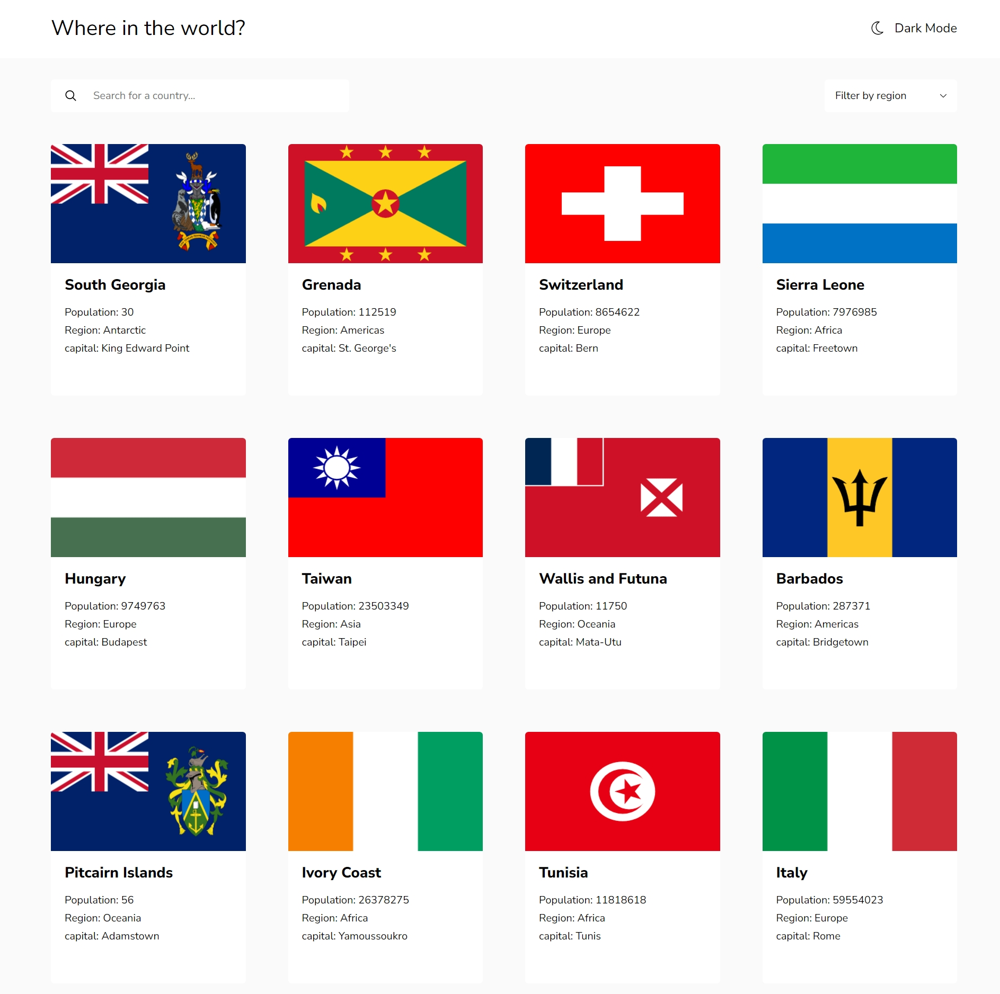
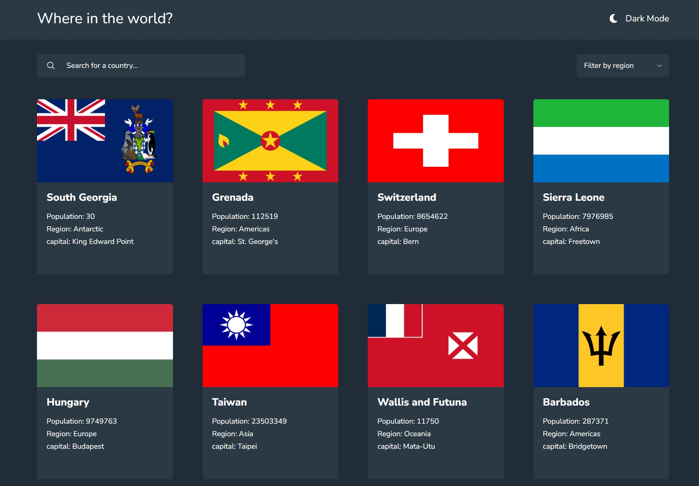
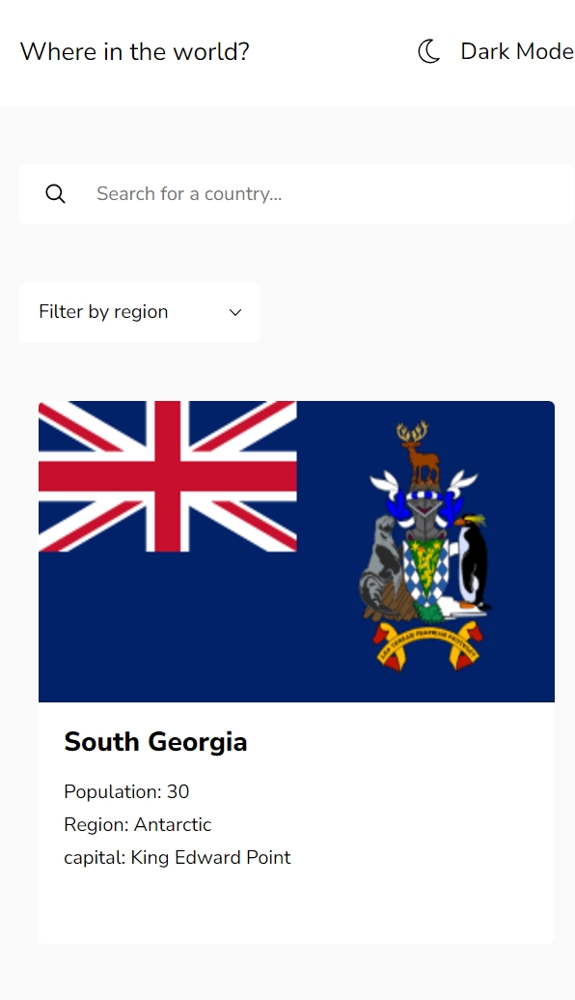
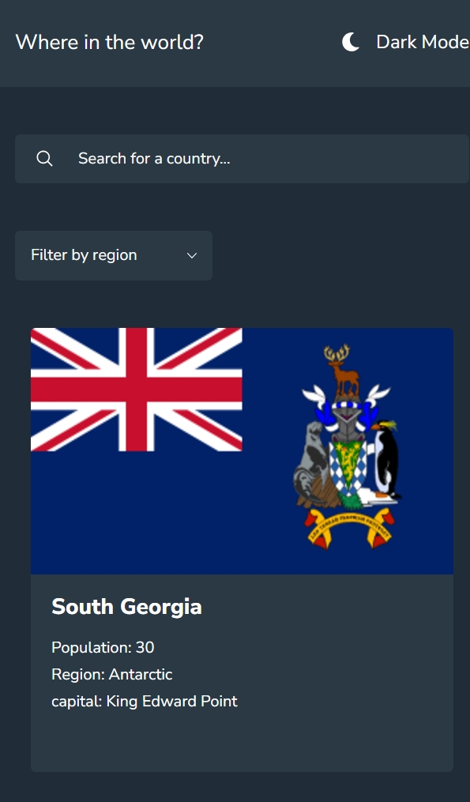
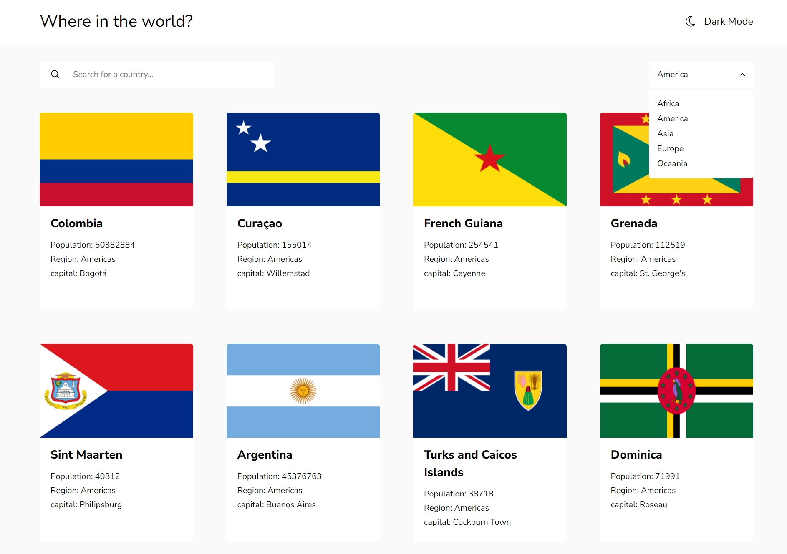
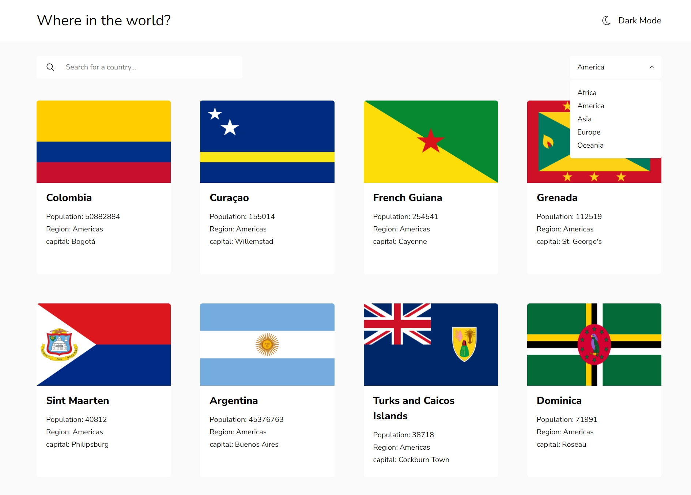
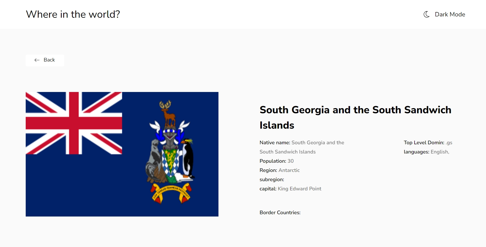
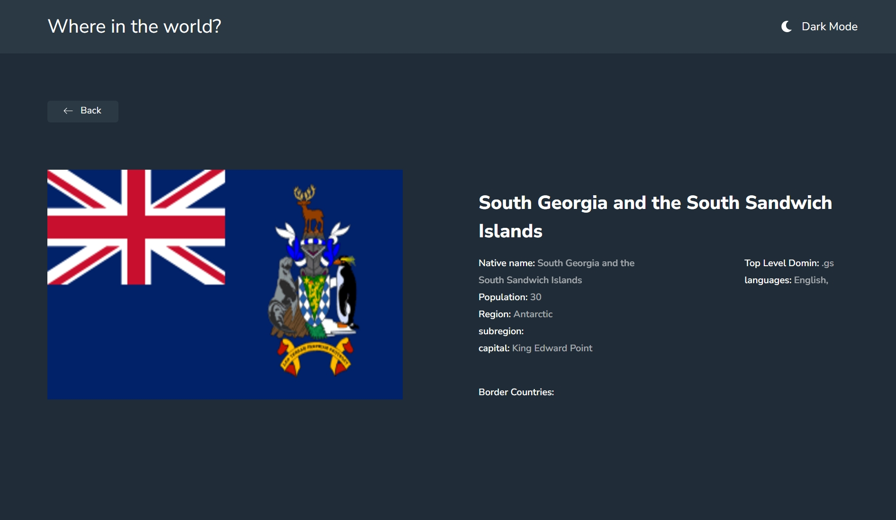
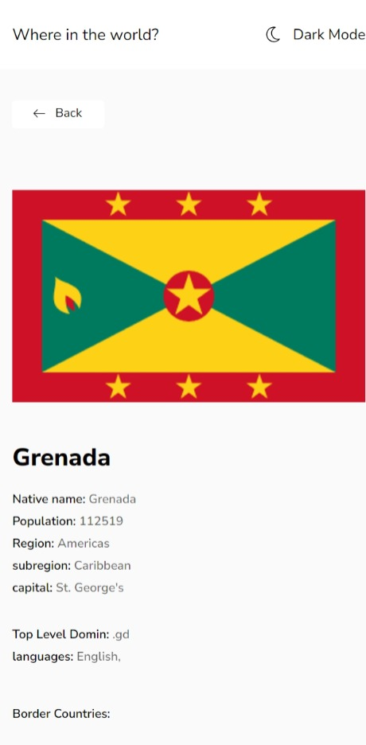
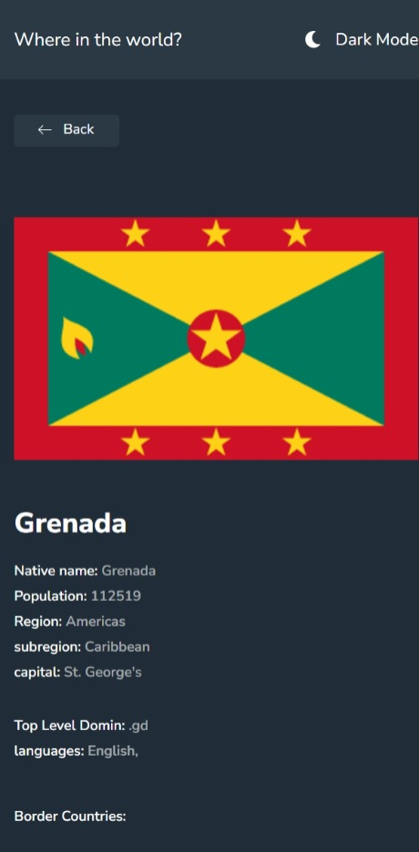

# Frontend Mentor - REST Countries API with color theme switcher solution

This is a solution to the REST Countries API with color theme switcher challenge on Frontend Mentor. Frontend Mentor challenges help you improve your coding skills by building realistic projects.

## Table of contents

- [Overview](#overview)
  - [The challenge](#the-challenge)
  - [Screenshots](#screenshots)
- [My process](#my-process)
  - [Built with](#built-with)
  - [What I learned](#what-i-learned)

## Overview

### The challenge

Users should be able to:

See all countries from the API on the homepage
Search for a country using an input field
Filter countries by region
Click on a country to see more detailed information on a separate page
Click through to the border countries on the detail page
Toggle the color scheme between light and dark mode (optional)

### Screenshots

## My process

### Built with

- Semantic HTML5 markup
- CSS custom properties
- Flexbox
- CSS Grid
- Desktop-first workflow
- [React](https://reactjs.org/) - JS library

### What I learned

This challenge has helped a lot with dealing with APIs and Routing in react.
